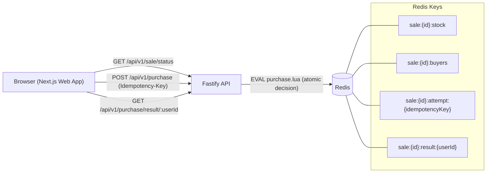
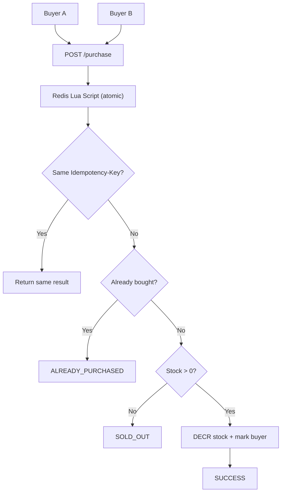
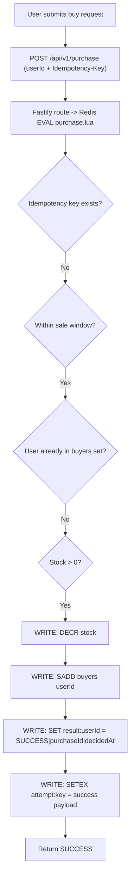
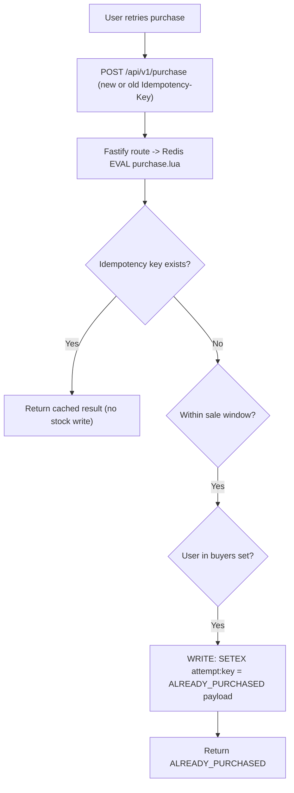
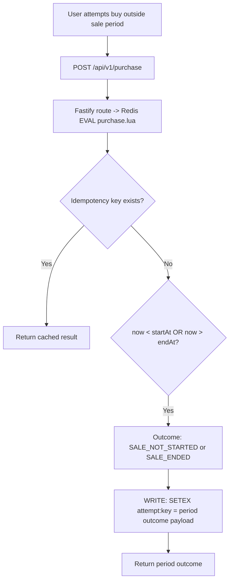

# Flash Sale Design Decisions

## Context and goals

This system implements a single-product flash sale with two hard correctness goals under high concurrency:

- No oversell.
- One successful purchase per user.

The implementation is intentionally optimized for deterministic decisioning in the hot path (`POST /api/v1/purchase`) using Redis as the authoritative store.

## Chosen approach summary

The purchase path uses a Redis Lua script (`apps/api/src/lua/purchase.lua`) as the atomic decision engine. The API route (`apps/api/src/routes/purchase.ts`) validates input, executes one Redis `EVAL`, and returns a decision-complete outcome.

Core data model (Redis keys):

- `sale:{id}:stock`: remaining stock counter.
- `sale:{id}:buyers`: set of user IDs that already purchased.
- `sale:{id}:attempt:{idempotencyKey}`: cached idempotent attempt result (`SETEX`).
- `sale:{id}:result:{userId}`: user-facing final result for lookup.

Decision order in Lua is:

1. Existing idempotency result.
2. Sale not started.
3. Sale ended.
4. Already purchased.
5. Sold out.
6. Success (`DECR` stock + `SADD` buyer + save result).

This order yields the documented outcome precedence: `SALE_NOT_STARTED -> SALE_ENDED -> ALREADY_PURCHASED -> SOLD_OUT -> SUCCESS`.

## System diagram

## Simple concurrency diagram

## Purchase flow diagrams

### 1) User never bought and is buying

### 2) User bought and is still trying to buy

### 3) User trying to buy outside sale period

## Decision log

| Decision | Alternatives considered | Why chosen | Tradeoffs |
|---|---|---|---|
| Redis + Lua as atomic decision engine for purchase | Multi-step API checks/writes; DB transaction-based locking | Single-script atomicity prevents race conditions and oversell under concurrency | Adds Lua script complexity and Redis coupling |
| Require `Idempotency-Key` for `POST /purchase` and cache result by attempt key with TTL | Best-effort retry handling without idempotency; server-generated retry correlation only | Safe client retries return the same decision without double-decrementing stock | Idempotency scope is bounded by TTL and key quality from client |
| Persist per-user result key (`result:{userId}`) separate from attempt key | Derive user result only from attempts; no dedicated user-result record | Supports `GET /api/v1/purchase/result/:userId` with O(1) lookup independent of request key reuse | Extra write on success, additional key management |
| No database in purchase critical path | Synchronous write-through to SQL/NoSQL during purchase | Keeps latency low and correctness centered on one atomic system (Redis) | No durable audit store in current implementation |
| Fail closed on Redis errors: return `503` + `TEMPORARILY_UNAVAILABLE` | Accept request and reconcile later; mixed partial fallback path | Avoids uncertain writes and preserves correctness contract when decision engine is unavailable | Reduced availability during Redis outage |
| Decision-complete API response (`outcome`, `purchaseId`, `remainingStock`, `serverTime`) | Async acceptance (`202`) with later polling only | Simpler client behavior and explicit outcome semantics per request | Tight contract coupling between Lua decision codes and API enums |

## Operational implications

### Scaling

- The write hot path is a single Redis `EVAL`, which minimizes round-trips and lock contention.
- Horizontal API scaling is straightforward because correctness state is externalized to Redis keys.
- Stock checks for `GET /sale/status` also depend on Redis (`sale:{id}:stock`).

### Graceful surge handling and accurate inventory

- Purchase decisions execute as one atomic Lua operation, so even when many requests arrive at the same time, stock checks and stock decrement happen together without race conditions.
- Because each success path performs `DECR` and buyer tracking in the same script, inventory cannot drop below the intended sold quantity (no oversell from concurrent writes).
- Outcome precedence is deterministic (`SALE_NOT_STARTED -> SALE_ENDED -> ALREADY_PURCHASED -> SOLD_OUT -> SUCCESS`), so under load the system returns stable and predictable outcomes instead of conflicting states.
- `Idempotency-Key` handling absorbs client/network retries during spikes: duplicate attempt keys return the original outcome instead of consuming additional stock.
- The API tier remains stateless for decisioning, allowing horizontal scaling of API instances while Redis remains the single correctness authority.
- On Redis failure, the API fails closed with `503 TEMPORARILY_UNAVAILABLE` rather than attempting uncertain writes, preserving inventory correctness during partial outages.

### Failure modes

- Redis unavailable or command failure in `POST /purchase`: API returns `503` with `TEMPORARILY_UNAVAILABLE` and `remainingStock: -1`.
- Redis unavailable in read endpoints: status/result endpoints can also fail because they read from Redis.
- Idempotency key reuse with different intent is client-risky; server treats same key as same attempt by design.

### Observability and operability

- Outcome semantics are explicit and stable through enums mapped from Lua numeric codes.
- `serverTime`/`decidedAt` are returned in ISO format for client/server event correlation.
- Current implementation has limited built-in observability (no dedicated metrics/tracing pipeline in these sources), so operational insight is mainly from API responses and logs.

## Known limitations and future improvements

Known limitations in current repo:

- No authentication/authorization; `userId` is trusted input.
- No durable audit database in the implemented critical path.
- Idempotency record retention is TTL-based, not permanent.
- Rate limiting and abuse controls are not implemented.

Potential improvements:

- Add durable asynchronous event/audit sink without adding DB writes to the purchase critical path.
- Add metrics for outcome counts, Redis latency/errors, and idempotency hit rate.
- Add auth and stronger user identity guarantees to enforce one-user semantics more securely.
- Add explicit runbooks for Redis outage and recovery behavior.
